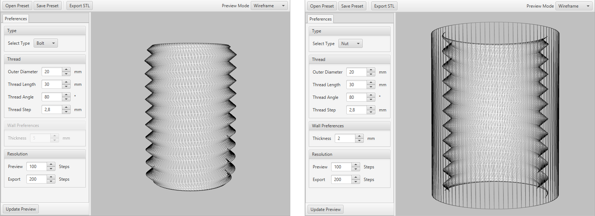

# Thread2STL 

It's just a very basic tool to generate custom nuts and bolts. Useful for 3D printing since the only format you can export is STL. I wrote this while OpenSCAD was busy rendering a simple screw for me <3

### How to run
You will need to have a Java Runtime Environment (one that ships with javaFX) installed on your computer to run Thread2STL. If thats the case then download the `Thread2STL.jar` from the releases page. Since it's an executable .jar file either double click will be sufficient or
`java -jar Thread2STL.jar` should do the trick.

### Screenshots

### General Info
The STL files are in ascii format which is why they become quite large depending on your preferences. Also not every other program can read this format.